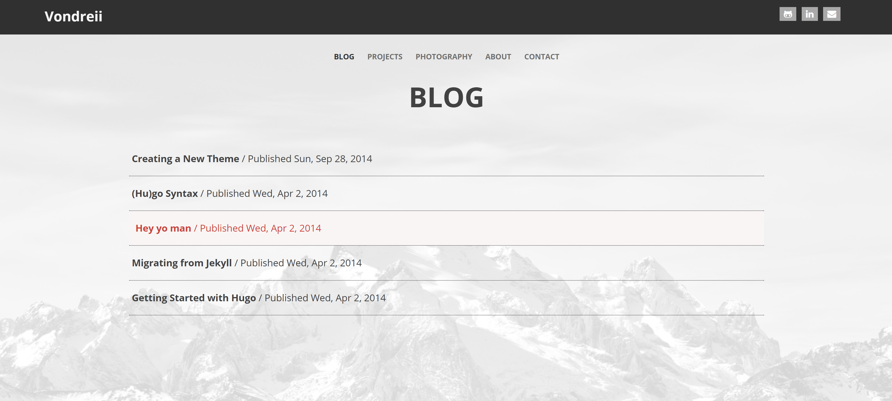

# old-personal-website
These are old versions of my personal website.

## Version 1

The first time I tried creating this website, I used Hugo, which uses pre-built themes from https://themes.gohugo.io/.

### To Run

Make sure you have Hugo installed on your computer. 

Use a terminal to navigate to the 'version 1' folder.

Run 'hugo serve'.

