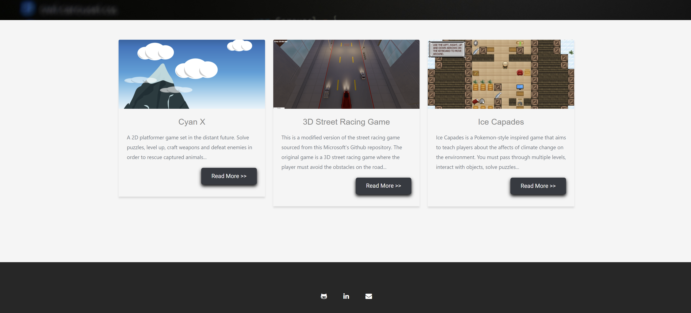
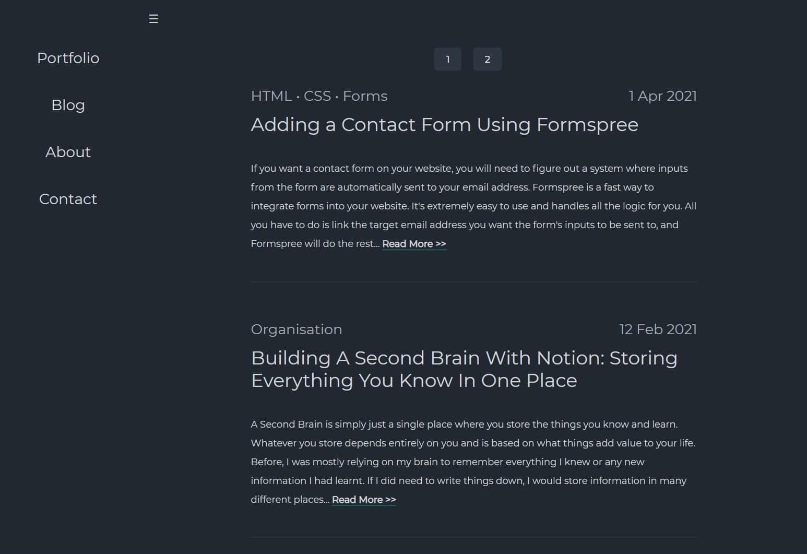

# old-personal-website
These are old versions of my personal website, https://Vondreii.com, while I was experimenting with different web technologies.

## Version 1

The first time I tried creating this website, I used Hugo, which uses pre-built themes from https://themes.gohugo.io/.

### To Run

* Make sure you have [Hugo](https://gohugo.io/getting-started/installing/) installed on your computer. 
* Use a terminal to navigate to the `version 1` folder.
* Run `hugo serve`.

## Version 2

I converted the hugo site into a static HTML/CSS site.

### To Run

* In the `version 2` folder, open `index.html`. It should open in a browser.

## Version 3

Changed the site to use Angular.

## To Run

* Run `npm install` in the root directory to add the necessary npm packages to the project.
* Once completed, run `ng serve`.
* Navigate to `localhost:4200` in a browser.

## To Build

* Run `ng build` to build the project. The build artifacts will be stored in the dist/ directory. 
* Use `ng build --prod` for a production build.

## Version 4

Changed the design to a dark mode.

## To Run

* Run `npm install` in the root directory to add the necessary npm packages to the project.
* Once completed, run `ng serve`.
* Navigate to `localhost:4200` in a browser.

## To Build

* Run `ng build` to build the project. The build artifacts will be stored in the dist/ directory. 
* Use `ng build --prod` for a production build.

